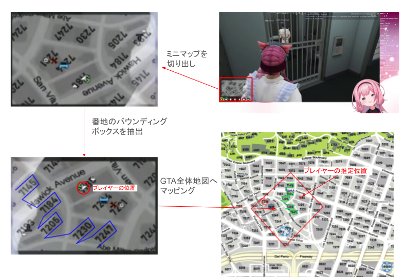
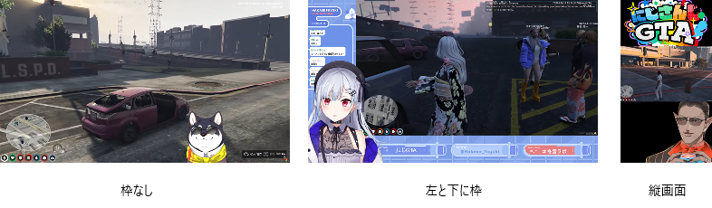
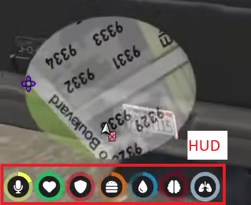
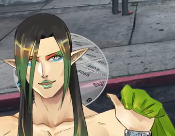
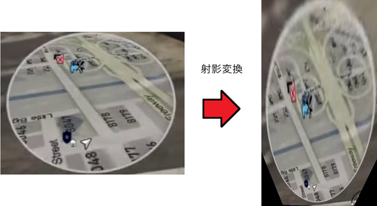
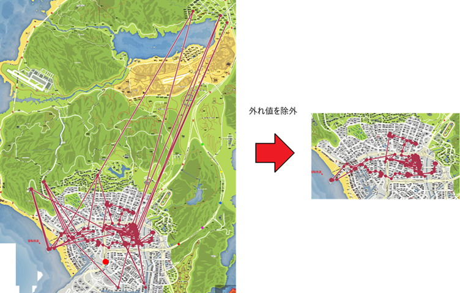

# 技術的な話

にじGTAライバーMAPの各ライバーのGTA内での位置情報をどのように集めたかについてまとめておきます。

## おおまかな仕組み

GTAではプレイヤー周辺のミニマップが左下に表示されるため、このミニマップを手がかりにして位置を推定しています。

具体的には、以下のように推定しています。

 * 各ライバー視点の動画について、5秒毎に以下を行う
   1. 動画の画像からミニマップの画像を取得
   2. ミニマップ上の番地表記をOCRで解釈。番地のバウンディングボックスも取得
   3. ミニマップ上の番地のバウンディングボックスからGTAの全体地図の番地への射影変換を求める
   4. 射影変換を使って、ミニマップ上のプレイヤーの位置からGTAの全体地図上の位置を求める

## ミニマップの取得

ミニマップはゲーム画面の特定の位置に表示されるから座標を決め打ちして切り出せばよい、と思うかもしれないですが、配信画面の場合ライバーごとに画面レイアウトが異なるため、ミニマップの位置を決め打ちすることはできません。

ミニマップの下にはHUDが表示されるため、HUDの画像でテンプレートマッチングして、HUDの位置を基準にミニマップの切り出し位置を推定しています。
画面レイアウトによってゲーム画面のサイズも変わるため、HUDの画像サイズを変えてマッチすることでゲーム画面サイズの推定も行っています。

### エラーケース

この方法でうまくいかないケースもままあります。

 * 「HUDが表示されている == ミニマップが表示されている」とは限らない。所持アイテムを表示しているときなどミニマップが出てないケースでもミニマップがあると想定して切り出してしまう。
 * ゲーム設定次第でHUDの表示が変わりうる。特に100%の項目を表示しないケースでは場面ごとでHUDの表示が変わりやすく、テンプレートマッチングでマッチしないことが多い。
 * ゲーム設定によっては「車に乗っているときだけミニマップが出る」場合があり、徒歩でのミニマップが切り出せないことがある。
   * にじGTA開始直後はこの設定が多かった。
 * そもそも配信レイアウト上ミニマップやHUDが映らないことがある。
   * 例
   * 

エラーケースの対処としては、ミニマップが取れてない動画を特定して、ミニマップ位置を都度決め打ちで与えて再解析する対処をしています。

## ミニマップから位置推定

にじGTAのミニマップには番地が表記されているので、[EasyOCR](https://github.com/JaidedAI/EasyOCR)で各番地の文字列とバウンディングボックスを取得します。

ミニマップはプレイヤーの向きに応じて回転するため、ミニマップを0度、90度、180度、270度に回転したそれぞれで番地を抽出し、もっとも妥当な番地群を抽出できたケースを採用しています。

また、乗り物に乗っている場合（車、ヘリなど）はミニマップが俯瞰的な表示になるため、このままでは文字が歪んで番地抽出が失敗しやすくなります。
対策として、俯瞰モードに対する逆変換（射影変換）を予め求めておき、逆変換を適用した画像でも番地抽出をしています。

番地抽出ができたら、ミニマップ上の番地のバウンディングボックスとGTA全体地図上の番地のバウンディングボックスとの対応を取ることができます。
この対応関係から、ミニマップからGTA全体地図への射影変換を求め（OpenCVの[findHomography()](https://docs.opencv.org/4.x/d9/d0c/group__calib3d.html#ga4abc2ece9fab9398f2e560d53c8c9780)を利用）、この射影変換でミニマップ上のプレイヤーの位置（これは固定）からGTA全体地図上の位置が求まります。

### エラーケース

位置推定がうまくいかないケースがいくつかあります。

* 山間部、海上（客船強盗、オイルリグを含む）、高速道路など
  * 周囲に番地がほとんどないため、位置推定ができなかったり誤判定したりする
  * OCRで番地を取り違えたときに誤判定を除外できない。市街地なら番地が多数抽出できるため、一つの番地の判定が誤っても引きづられにくいが、番地が少ないと誤判定に引っ張られる。
* 逆さにしても番地として解釈できてしまうケース
  * 「9008」を「8006」（180度回転）と誤判定するなど。
  * ミニマップの回転がわからないため、いろいろな角度でOCRを試しているのが原因。プレイヤーの向きが正確に分かればいいが…。
* アイテム名を誤判定するケース
  * 所持アイテムを表示しているときは実際にはミニマップが出てないのにミニマップが出てる想定で解析してしまい、アイテム名を番地と解釈してしまう。
* 画質悪化で番地抽出できないケース
  * 動画のエンコーディングの都合上、画面の変化が大きいと画質が下がりやすい。この場合OCRが失敗しがち。
  * 車で高速移動している場合に起きやすい。
* その他OCR系の誤判定など。

## 誤判定の補正

上記の推定ではたびたび誤判定が発生するため、時系列で見て外れ値の点を除外することで対処しています。

大まかなケースとしては以下の通り。
 * A - B - Cのように点があり、AとB、BとCが極端に遠く、AとCが近い場合は点Bを除外。
   * `/hoten`やリサセン、車の試乗など、ゲーム内の仕様でワープするケースもあるため、これらの移動は除外しないようにする。
 * 取り違えやすい番地の点をまとめて除外する（「1001」を「1091」と誤判定している場合など）。

## 時刻の補正

GTAではゲーム内時間（分単位）が右上に表示されているため、この時間を正にするようにしています。

しかし、常にゲーム画面からこのゲーム時間が取れるとは限りません。
 * 配信レイアウト上ゲーム内時間が隠れている
 * 背景と色が重なって読み取れない

そのため、配信開始からの経過時間をベースにしつつゲーム内時間との誤差を計測して補正しています。

ゲーム内時間との誤差は以下のように求めています。
 * 動画内のランダムな時刻（ただしプレイヤー位置の取得は成功している）から120秒間について、毎秒画面右上にOCRをかけ、ゲーム内時刻の文字列を読み取る
 * 120秒間の中でゲーム内時刻の分が変わるタイミングを求める
 * 分が変わるタイミングのゲーム内時刻と`(配信開始時刻 + 配信開始からの経過時間)`との誤差を求める

自動で誤差が取れなかったケースについては人力で誤差を求めています。

## 人力の補正

自動での補正で直しきれなかったケースは人力で補正するツールを用意して適宜修正しています。

が、なにせ800本近い動画があり、それらすべてをくまなくチェックするというのは現実的ではないので、発見ベースでじわじわ直す感じになりそうです。

## 諦めた手法

* 特徴点マッピングでミニマップからGTA全体地図へのマッピングを求めるアプローチ
  * 道の形状を特徴点として拾えるのでは？それなら番地がまばらなエリアも対応できるのではということで試した
  * 試したところ特徴点として番地の文字ばかりが集まり、かつマッピングを誤りがちだった
  * 配信画面ではミニマップがぼやけがちで、道の形状は特徴点になりにくかった
* ゲーム画面全体からの学習
  * まわりの風景などミニマップ以外の情報も使えるのでは？
  * 学習データをどう集めるんじゃいということで着手せず